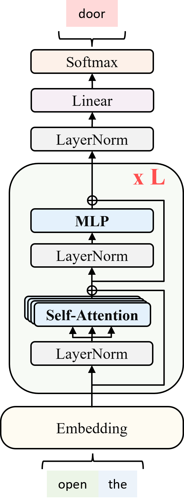
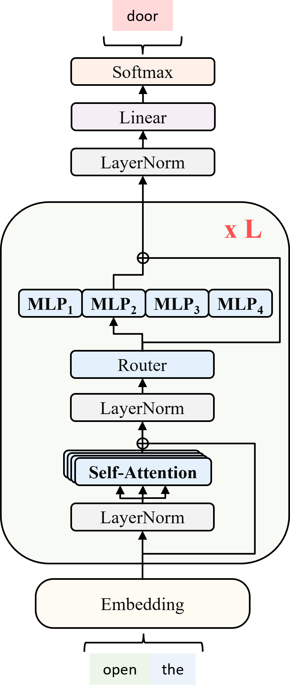
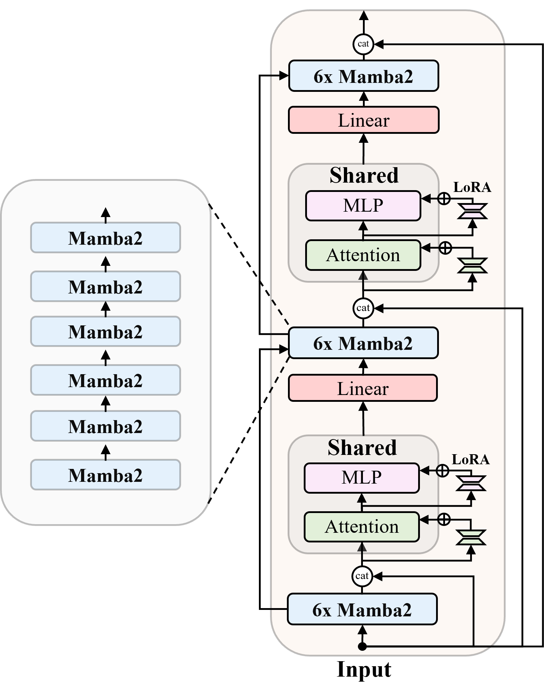

# The Zyphra Training Cookbook
By Quentin Anthony, Beren Millidge, Paolo Glorioso, and Yury Tokpanov

Training hybrid models is hard, and papers tend to gloss over the practical engineering work that goes into building good ones. The purpose of this cookbook is to enable other technical groups to hit the ground running when building their own hybrid (SSM, Transformer, MoE) models.

For context, we at Zyphra have built the following hybrid models:
- [BlackMamba](https://arxiv.org/abs/2402.01771)
- [Zamba-7B](https://www.zyphra.com/post/zamba)
- [Zamba2-2.7B](https://www.zyphra.com/post/zamba2-small)
- [Zamba2-1.2B](TODO)

The following datasets:
- [Zyda](https://www.zyphra.com/post/zyda)

And the following engineering optimizations
- [Tree Attention](https://www.zyphra.com/post/tree-attention-topology-aware-decoding-for-long-context-attention-on-gpu-clusters)

# Introduction: How Zyphra thinks about Hybrid Models

Dense transformer models (i.e. alternating multi-head attention (MHA) and multilayer perceptron (MLP) blocks) have dominated the DL model space for a long time. The reason for this is simple: 
1. MHA computes exact cross-sequence dependencies, and consists of GEMMs, which are easy to parallelize across many GPU SMs
2. MLPs mix the heads of MHA and perform per-token processing, and trivially boil down to GEMMs

Lots of LLM blocks (e.g. MHA, MLPs, RWKV, Mamba, KANs, xLSTM, etc) boil down to perform very similar modeling tasks. We at Zyphra intuit that the ingredients for a good LLM architecture are:
- Mixing information across the sequence (MHA, Mamba, RWKV sequence mixers)
- Updating representations per token (MLPs, KANs, Mamba in/out projectors and gates)

Typically, these components are alternated so that the sequence is mixed, the per-token representations are updated, the sequence is mixed again etc. A careful balance of sequence and token mixing is required for good performance. 

Therefore, potential LLM architectures should be evaluated on whether they:
1. Have lower FLOP and memory requirements. We believe this is most important at [inference-time](https://arxiv.org/pdf/2401.00448v1), but also helps training.
2. Maintain the benefits of exact cross-sequence modeling from MHA (can be measured by proxy via [long-context reasoning](https://arxiv.org/abs/2406.07887) and [in-context learning](https://arxiv.org/abs/2402.03170), and general language modelling evaluations)

The deployment context determines which of these properties is most important, for example:

1. Massive (100B-1T+) capabilities-focused models like Grok, Claude, and ChatGPT. These models have high parameter-counts (and therefore require more training tokens to saturate) and are deployed on cloud systems with high-VRAM GPUs (and often split between GPUs). This is why the low-FLOP and high-VRAM tradeoff of MoE is attractive.
2. Smaller (1B-15B) on-device special-purpose models like Zamba and Phi. These models require the lowest memory and latency at inference-time possible, and are deployed on embedded devices with strict power and memory constraints. Therefore they benefit more from SSM and hybrid architectures.

For larger models, the primary determinant of performance is [scale](https://arxiv.org/abs/2203.15556) in terms of parameters and data which reduces the importance of architectural changes except insofar as they change the scaling law coefficients. However, at smaller scales when e.g. the parameter count is fixed by hard memory limitations, architectural efficiencies which give constant improvements to performance at a given scale become important and can enable models to significantly outperform for a given inference flop and memory budget. This effect is also seen in training where superior architecture enables models to compete with standard transformers which are trained on significantly more tokens (requiring significantly more flops) since training far past chinchilla optimal models at fixed parameter count runs into strongly sublinear scaling. Because of this, a small absolute improvement in performance due to architecture can overcome a 2-10x token budget advantage far from the chinchilla optimal point, as we observe with our Zamba1 and Zamba2 models. 

Since Zyphra seeks to build personalized on-device models, this cookbook will be focused on the practical implications of architectures falling into the smaller-model regime #2. We also focus heavily on architectural innovations to maximize the loss-decrease per parameter and per inference flop. 

The key current focus of innovation is on the sequence mixer. This is because attention is expensive at long sequence lengths while MLPs appear close to maximal efficiency. While much is still uncertain, there appears to be converging evidence that alternative linear attention variants such as Mamba, RWKV, RetNet perform well at short context language modelling while being lacking at long-context reasoning, information retrieval, and in-context learning. However, despite this slight deficit on some aspects of performance, they are significantly more FLOP and memory efficient than attention layers.

This motivates a hybrid architecture which mixes attention and linear sequence mixers such as Mamba. This way, the majority of the sequence mixers are more efficient than attention while just enough full attention is used to maintain performance. Empirically, it appears that full attention is not needed every single sequence mixer but that substantially less attention can be used, which is what enables hybrids to work empirically. A similar findings have also recently been popularized applied to transformers with some recent models such as those used by [CharacterAI](https://blog.character.ai/optimizing-ai-inference-at-character-ai/) claiming to alternate sliding-window-attention over a small window and full attention blocks. This has an equivalent effect of using cheap local sequence mixers and occasionally full attention but is less efficient than Mamba since sliding-window-attention is less efficient per FLOP than a Mamba block. The likely reason for this relates to the data distirbution. Natural language is often surprisingly predictable from primarily local correlations -- i.e. see the surprising effectiveness of pure N-gram models. However, occasionally, there is long-term information retrieval or other in-context learning required which a smaller number of attention layers can handle. In our experiments, we observe that between only 1/4 or 1/6 sequence mixer layer should be full attention, a phenomenon also reported [here](https://arxiv.org/abs/2403.17844). 

## Reasoning behind the Zamba architecture

While several other works, such as [Jamba](https://huggingface.co/ai21labs/Jamba-v0.1), have explored SSM hybrid models at scale, with Zamba we have further improved the architecture on a performance-per-parameter metric. We have done this by utilizing a parameter-sharing scheme whereby a single transformer block consisting of an attention and a MLP block is re-used multiple times throughout the network. This comprises the only attention in the network. This increases the performance of the network for a given parameter count at the expense of additional flops for the multiple invocations of the shared parameters. However, given the inherent flop efficiency of our Mamba backbone, the end result is an architecture that outperforms transformers in both equi-token and equi-flop conditions.

What the success of this architecture implies is that even when attention is used rarely, there is still a great redundancy in the attention parameters -- namely that the vast majority of them are not needed. While sequencing mixing via full MHA is necessary regularly, somehow the attention block itself does not have to have separate parameters. We conjecture that this means that in fact the attention is primarily needed to 'remind' the network of the past sequence in a few stereotyped ways and not necessarily to perform novel sequence mixing operations at every attention block. In any case, the Zamba architecture exploits this regularity to reduce the parameter count of the model for a given level of performance.

An additional change we made to the architecture, which turned out to be surprisingly important, is to concatenate the original text embeddings with the current layer embeddings at every shared attention block. We found this provided the biggest boost (other than the shared layer) to performance per parameter, while again increasing FLOPs slightly. We conjecture that but doing this, we are effectively 'reminding' the network continually of what the input tokens are while otherwise the processing in the residual stream may 'forget' them or be unable to retrieve them in a different context than they were originally processed. While in theory the residual stream itself was originally designed to ameliorate this type of forgetting, the fact that this concatenation approach works implies it is not entirely successful. 

Beyond this, in later Zamba2 models we also applied LoRAs to the shared layers. This allows us to further specialize the shared blocks which slightly improves performance at a very small parameter cost. Using LoRAs in this way during pretraining is unusual and we believe it is an underexplored avenue for creating extremely parameter-efficient models.

(TODO: Dropdown on cross-sequence dependencies, and what I mean by "exact")

# Model Architectures

Let's talk about model architectures. Why do we think hybrids offer the best model quality per training/inference FLOP?

### Dense Transformers

Dense transformers, are primarily composed of alternating multi-head attention (MHA) and multilayer perceptron (MLP) blocks. We believe dense transformers have the following shortcomings:
1. The attention operation is still not efficient at long sequence lengths, despite recent [single-GPU efforts](https://arxiv.org/abs/2205.14135) and [distributed context efforts](https://arxiv.org/abs/2408.04093)
2. Attention blocks are correlated across depth, which is a waste of parameters and FLOPs

### MoE Architectures

Mixture of Experts (MoE) architectures introduce a router block that splits the input sequence(s) to appropriate MLP experts on a per-token basis. While the MoE has the inference latency of its forward-pass parameters, all parameters need to be loaded into memory.

### SSM/RNN Architectures

State Space Models (SSM) offer a more efficient alternative to traditional attention mechanisms, particularly beneficial for smaller models deployed on devices with strict power and memory constraints. Models like [Mamba](https://arxiv.org/abs/2312.00752) and [RWKV](https://arxiv.org/abs/2305.13048) leverage these architectures to achieve competitive performance with significantly lower FLOP and memory requirements.

However, the exact cross-sequence dependencies of attention is hard to beat, and models without attention can require significantly more tokens to match the performance of attention-based models (https://arxiv.org/abs/2406.07887, https://huggingface.co/tiiuae/falcon-mamba-7b). Whether such attention-free models can ever fully match the performance of attention-based models on specific tasks like in-context learning and long-context reasoning is an open question.

**Transformer**             |  **Mamba**   |  **Transformer-MoE**  |  **Mamba-MoE**
:-------------------------:|:-------------------------:|:-------------------------:|:-------------------------:
  |      |       |  

### Hybrid Architectures

Dense hybrid architectures combine the strengths of both dense transformers and SSMs. They don't introduce the memory overhead of MoEs, maintain the exact cross-sequence dependencies of attention, and have inference latency of SSMs.

**Zamba-7B**    |    **Zamba2-2.7B**       |  **Zamba2-1.2B**
:-------------------------:|:-------------------------:|:-------------------------:
     |      |    

# Data
(TODO: Yury)

For a script on calculating the number of tokens in a TODO-formatted dataset based on a given tokenizer, see [Token Calculation](#token-calculation)

# Calculations

During the model planning phase, it's common to calculate what models will fit into a given budget of parameters, FLOPs, and inference/training memory. In this cookbook we present scripts we use internally to compute the parameters and FLOPs for a given model architecture and sizing. We see this as an extension of the [EleutherAI cookbook](TODO) but specialized to SSMs and hybrid models.

## SSM Calculations
(TODO: Quentin/Beren/Paolo)

## Transformer Calculations

For dense and MoE transformers, we recommend using the [EleutherAI cookbook](https://github.com/EleutherAI/cookbook) by Quentin Anthony, Hailey Schoelkopf, and Stella Biderman.

## Hybrid Calculations
(TODO: Quentin/Beren/Paolo)

## Token Calculation
(TODO: Yury/Quentin)

# Benchmarks

## Block Benchmarks and Sizing
(TODO: Quentin)

## Communication
(TODO: Quentin/Vasu)

For communication benchmarks, there are two levels of tests: 
1. Microbrenchmark-level benchmarks in C/CUDA/C++ such as [OSU-Microbenchmarks](https://mvapich.cse.ohio-state.edu/benchmarks/) and [NCCL-tests](https://github.com/NVIDIA/nccl-tests). These are best for checking hardware, low-level communication software and drivers, and low-level communication optimizations (e.g. [SHARP](), communication algorithm tuning, etc).
    - 
    - 
2. Framework-level benchmarks in PyTorch/Jax such as those in the [EleutherAI cookbook](https://github.com/EleutherAI/cookbook). These are best to ensure that framework properties (e.g. synchronization, tensor dtype handling, etc) preserve the performance of microbenchmarks, and measure performance effects of framework-level optimizations (e.g. [tensor fusion/bucketing](https://pytorch.org/docs/stable/notes/ddp.html#internal-design), [CUDA graphs](https://pytorch.org/blog/accelerating-pytorch-with-cuda-graphs/), etc) and communication in the context of applications (e.g. communication/computation overlap)
    - 
    - 

In this cookbook, we provide framework-level benchmarks in Jax at TODO

# Training

We perform all our training using PyTorch within our custom internal fork of [MegatronLM](https://arxiv.org/abs/1909.08053). For smaller models we only need to utilize [Zero-1](https://arxiv.org/abs/1910.02054) to shard optimizer states. For larger models such as Zamba-7B, we utilized [tensor-parallelism (TP)](https://arxiv.org/abs/1909.08053) for which we created our own custom implementation in both Mamba and Mamba2. We also utilized [expert-parallelism (EP)](https://arxiv.org/abs/2305.13048) for training [BlackMamba](https://arxiv.org/abs/2402.01771). 

## Annealing

### What is Annealing?

We find, following [miniCPM](https://arxiv.org/html/2404.06395v1), that a simple curriculum training approach of increasing the proportion of higher quality tokens towards the end of training can significantly improve performance. 

'High quality' is obviously subjective in part but we find that documents containing fact-rich information to be the most performant. Examples include:
- Wikipedia and arxiv papers
- Instruction following and chat data 
- Synthetic fact-enhanced textbook style data such as [cosmopedia](https://huggingface.co/blog/cosmopedia).

In terms of the amount of annealing data, we find in general that more is better, although we are generally constrained by amount of available annealing data so that we have not been able to test truly large (>200B tokens) amounts of such data. This fits with the miniCPM findings of setting annealing to be about 10% of the total tokens of a run. We find that multiple epochs of annealing data do not appear to harm performance, yet beyond 2 epochs give little performance improvement. 

Annealing and LR Schedule Models/Papers

 

Model Tech Reports Using Annealing
- [Danube3](https://arxiv.org/abs/2407.09276)
- [miniCPM](https://arxiv.org/html/2404.06395v1)

Papers on Annealing/LR
- https://arxiv.org/abs/2406.03476
- https://arxiv.org/abs/2403.08763
- https://arxiv.org/abs/2405.16712v1

### Annealing LR Schedule

We performed significant ablations to explore the LR schedule. We made the following observations: 
- **The precise form of the LR decay (whether linear, cosine, or exponential) has relatively little effect on the final eval performance.** 
- The primary determinant of performance was the initial maximum LR of the annealing phase. 
- Unlike miniCPM, we found that re-warming up the LR to a large percentage (approximately 75%) of the original LR used in the pre-training phase and then decaying to zero outperformed starting at the final LR of the pre-training phase. After many ablations, we believe this is due to the fact that rewarming causes a significantly faster decay at the beginning of the annealing phase since the decay occurs over a much greater range in the same number of tokens.

### What is replay? How much do you need?

When doing annealing we find it is important to maintain a high 'replay fraction' of tokens from the original pre-training dataset to stabilize training and maintain performance. This is done both to extend the annealing phase so that the model has more optimizer steps to digest the annealing data, and to minimize forgetting of the original pre-training data distribution.

We typically find that a fraction of 50-70% 'replay' tokens from the original pre-training dataset and 50-30% tokens from the annealing datasets is optimal. Within this range there we find that the sensitivity to the exact replay fraction is quite low, yet we hold the intuition that replay should scale with the magnitude of the distribution shift between the pre-training and annealing datasets.

### Annealing Summary

Concretely, our reccomendations for annealing are:

1.) Generate as big a dataset of high quality tokens as possible up to likely about 10-15% of the total pretraining token budget

2.) Anneal with a replay fraction of between 50-70% original tokens

3.) Decay shape does not matter that much (cosine is fine)

4.) Use a max lr about 75% of original max lr for the phase 1 pretraining and a linear warmup from 0 to this maxlr over a few thousand steps

## Bonus: Efficient Decoding
(TODO: Vasu/Jon)
